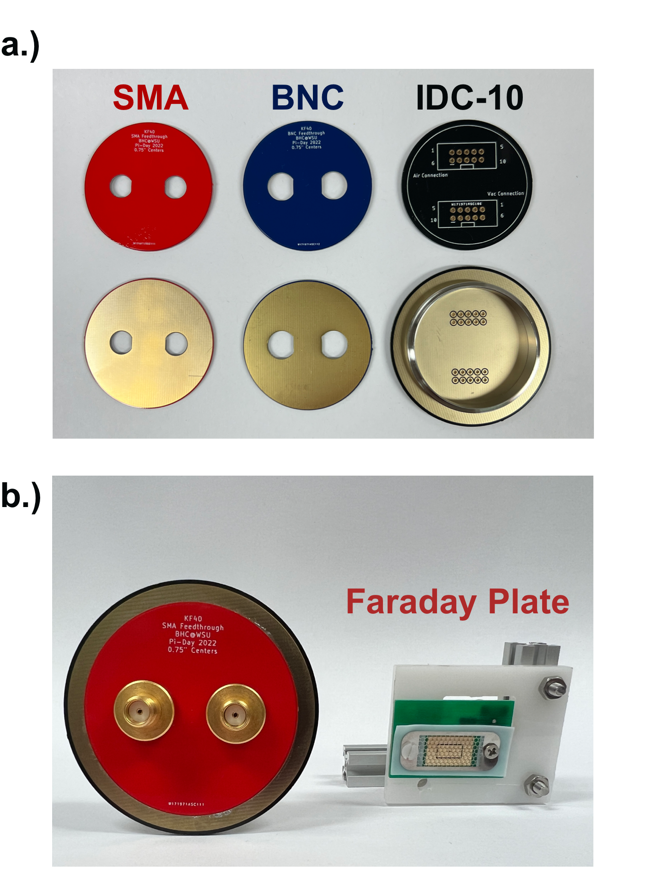

# PCB-Based Vacuum Feedthroughs
The following KiCad files simplify the development of SLIM platforms using PCBs as the foundation for vacuum-compatible vacuum feedthroughs. Given that the SLIM platform operates using a few torr, outgassing is a very minor concern. As the picture below illustrates, the outring and the inner ring are soldered together in a concetric form that form a structure that is directly compatible with a KF40 connector. 

These research products were developed with the support of the [NIGMS](https://www.nigms.nih.gov/) R01-GM140129

